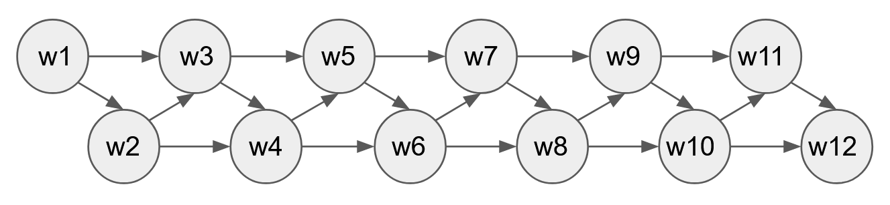

# Name-Generator

Created a name generator using bayesian network.

Library - [pgmpy](https://pgmpy.org/) (a library for probabilistic graphical models)

## Model image

The bayesian network model was defined as the image below. The second word is conditioned by the first word and the following words are conditioned by 2 words prior to itself.

